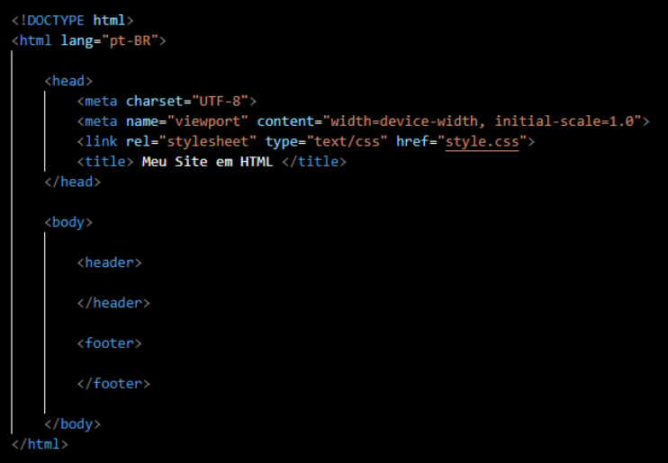

# HTML (HyperText Markup Language)

A linguagem **HTML (Linguagem de Marcação de Hipertexto)** é a base estrutural da web. Seu principal objetivo é organizar e estruturar conteúdos como textos, imagens, links, tabelas, vídeos e outros elementos que compõem as páginas de um site.

O HTML não é uma linguagem de programação, mas sim de marcação, pois utiliza tags (etiquetas) para indicar ao navegador como o conteúdo deve ser exibido. Essas tags atuam como instruções que definem títulos, parágrafos, listas, links, seções, formulários e muito mais.

Com o crescimento da internet e a popularização dos dispositivos digitais, o HTML passou a ser uma ferramenta essencial para o desenvolvimento de interfaces digitais acessíveis, organizadas e compatíveis com diversos navegadores e plataformas. Sua evolução ao longo dos anos, com versões mais modernas como o HTML5, tornou possível incorporar recursos multimídia, sem depender de plugins externos.

Assim, o HTML desempenha um papel fundamental na experiência do usuário na web, sendo amplamente utilizado em conjunto com CSS (para o estilo visual) e JavaScript (para interatividade), formando o tripé básico do desenvolvimento front-end.

## Estrutura Básica

Um arquivo HTML segue uma estrutura padrão que define como uma página web deve ser organizada e interpretada pelos navegadores. Vamos entender cada parte do exemplo:

1. **Declaração do tipo de documento.**
    
    `<!DOCTYPE html>`

    Indica ao navegador que este é um documento HTML5, a versão mais atual da linguagem. É obrigatório no início do código.

2. **Tag raiz do documento.**

    `<html lang="pt-BR"> ... </html>`

    Abrange todo o conteúdo da página. O atributo **lang="pt-BR"** informa que o conteúdo está em português do Brasil, o que ajuda na acessibilidade e em ferramentas de busca.

3. **Cabeçalho da Página**

    `<head> ... </head>`

    Contém informações de configuração que não aparecem visualmente no site, mas são fundamentais para o funcionamento e interpretação da página.

    `<meta charset="UTF-8">` 

    Define o **conjunto de caracteres** usado na página (UTF-8, que suporta acentuação e símbolos especiais).

    `<meta name="viewport" content="width=device-width, initial-scale=1.0">`

    Torna o site **responsivo**, ou seja, adaptável a diferentes tamanhos de tela (celular, tablet, etc.).

    `<link rel="stylesheet" type="text/css" href="style.css">`

    Faz a ligação com o arquivo externo de **CSS**, responsável pelo **estilo visual** da página (cores, fontes, tamanhos etc.).

    `<title> Meu Site em HTML </title>`

    Define o **título da página**, que aparece na aba do navegador.

4. **Corpo da página**

    `<body> ... </body>`

    É onde está o conteúdo **visível ao usuário** (textos, imagens, menus, rodapés, etc.).

    **Cabeçalho**

    `<header> </header>`

    A tag `<header>` representa o cabeçalho da página, geralmente onde ficam o logotipo, o menu de navegação ou o nome do site.

    **Rodapé**

    `<footer> </footer>`

    A tag `<footer>` representa o rodapé, onde normalmente ficam informações de contato, direitos autorais, redes sociais ou links importantes.

