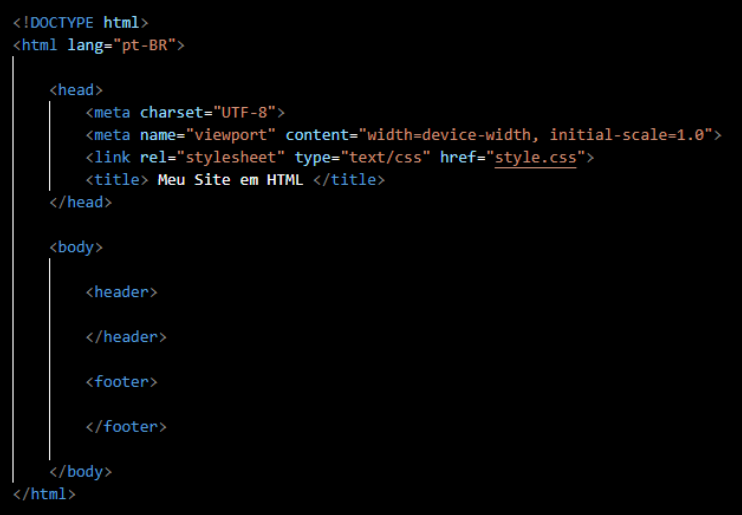

# HTML (HyperText Markup Language)

A linguagem **HTML (Linguagem de Marcação de Hipertexto)** é a base estrutural da web. Seu principal objetivo é organizar e estruturar conteúdos como textos, imagens, links, tabelas, vídeos e outros elementos que compõem as páginas de um site.

O HTML não é uma linguagem de programação, mas sim de marcação, pois utiliza tags (etiquetas) para indicar ao navegador como o conteúdo deve ser exibido. Essas tags atuam como instruções que definem títulos, parágrafos, listas, links, seções, formulários e muito mais.

Com o crescimento da internet e a popularização dos dispositivos digitais, o HTML passou a ser uma ferramenta essencial para o desenvolvimento de interfaces digitais acessíveis, organizadas e compatíveis com diversos navegadores e plataformas. Sua evolução ao longo dos anos, com versões mais modernas como o HTML5, tornou possível incorporar recursos multimídia, sem depender de plugins externos.

Assim, o HTML desempenha um papel fundamental na experiência do usuário na web, sendo amplamente utilizado em conjunto com CSS (para o estilo visual) e JavaScript (para interatividade), formando o tripé básico do desenvolvimento front-end.

## Estrutura Básica

Um arquivo HTML segue uma estrutura padrão que define como uma página web deve ser organizada e interpretada pelos navegadores. Vamos entender cada parte do exemplo:



1. **Declaração do tipo de documento.**
    
    `<!DOCTYPE html>`

    Indica ao navegador que este é um documento HTML5, a versão mais atual da linguagem. É obrigatório no início do código.

2. **Tag raiz do documento.**

    `<html lang="pt-BR"> ... </html>`

    Abrange todo o conteúdo da página. O atributo **lang="pt-BR"** informa que o conteúdo está em português do Brasil, o que ajuda na acessibilidade e em ferramentas de busca.

3. **Cabeçalho da Página**

    `<head> ... </head>`

    Contém informações de configuração que não aparecem visualmente no site, mas são fundamentais para o funcionamento e interpretação da página.

    `<meta charset="UTF-8">` 

    Define o **conjunto de caracteres** usado na página (UTF-8, que suporta acentuação e símbolos especiais).

    `<meta name="viewport" content="width=device-width, initial-scale=1.0">`

    Torna o site **responsivo**, ou seja, adaptável a diferentes tamanhos de tela (celular, tablet, etc.).

    `<link rel="stylesheet" type="text/css" href="style.css">`

    Faz a ligação com o arquivo externo de **CSS**, responsável pelo **estilo visual** da página (cores, fontes, tamanhos etc.).

    `<title> Meu Site em HTML </title>`

    Define o **título da página**, que aparece na aba do navegador.

4. **Corpo da página**

    `<body> ... </body>`

    É onde está o conteúdo **visível ao usuário** (textos, imagens, menus, rodapés, etc.).

    **Cabeçalho**

    `<header> </header>`

    A tag `<header>` representa o cabeçalho do documento, geralmente onde ficam o logotipo, o menu de navegação ou o nome do site.

    **Rodapé**

    `<footer> </footer>`

    A tag `<footer>` representa o rodapé, onde normalmente ficam informações de contato, direitos autorais, redes sociais ou links importantes.

   **Área Principal**

   `<main> </main>`

   Essa tag não está presente na imagem anterior, mas costuma ser incluída entre as tags `<header>` e `<footer>`.

   A tag `<main>` define o conteúdo principal de um documento, focando no tema central da página. Semanticamente, essa tag indica aos motores de busca e tecnologias assistidas (leitores de tela) a principal área da página.

## Tags Básicas (Títulos, Parágravos e quebras de linha)

### Títulos

`<h1> </h1>` a `<h6> </h6>`

Os títulos do corpo de uma página são definidos pelas tags de `<h1>` a `<h6>`. São utilizadas para definir uma hierarquia de títulos do conteúdo, do `<h1>` (mais importante) até o `<h6>` (menos importante), definindo a estrutura lógica da página. São essenciais para SEO. Deve-se usar apenas um `<h1>`por página.

**Exemplo:**
```html
<h1>Título de nível 1</h1>
<h2>Título de nível 2</h2>
```

### Parágrafos

`<p> </p>`

Os parágrafos, em HTML, são definidos pela tag `<p>`, que representa um bloco de texto, ocupando toda a largura disponível. É uma das estruturas mais básicas e importantes na organização de conteúdos em uma página WEB.

Por padrão, cada parágrafo ocupa um espaço antes e depois do texto, separando-o dos outros elementos adjacentes.

**Exemplo:**
```html
<p>Primeiro parágrafo</p>
<p>Segundo parágrafo</p>
```

### Quebras de linha

`<br>`

A tag `<br>` insere uma quebra de linha no texto sem criar um novo parágrafo. Essa tag é chamada de **tag vazia**, isto é: não precisa de uma tag de fechamento. 

Diferente da tag `<p>`, a tag `<br>` apenas quebra a linha, não adicionando um espaçamento vertical significativo.

**Boas práticas**
- Não use a tag `<br>` para criar espaçamento entre elementos (use o CSS para esse objetivo). 
- Use apenas quando fizer sentido semântico.
- Use CSS (`margin`, `padding`) para controlar o espaçamento.

`<hr>`

A tag `<hr>` é usada para criar uma linha horizontal indicando uma separação temática entre conteúdos. Como a tag `<br>` é uma **tag vazia**, não possuindo um conteúdo interno nem uma tag de fechamento.

Por padrão, essa tag ocupa toda a largura disponível.

**Exemplo:**
```html
<p>
Endereço:
<hr>
Rua Principal, 250<br>
Centro<br>
Belo Horizonte - MG
</p>
```

## Tags Estilísticas (negrito, itálico, sublinhado)

As tags estilísticas só devem ser usadas quando o objetivo é apenas mudar a aparência do texto (negrito, itálico, sublinhado), sem adicionar valor semântico.

- `<b>` **(Bold - negrigo)**: Destaca o testo em negrito, sem dar destaque de importância. Pode ser usado em palavras-chave, nomes de produto, rótulos...
- `<i>` **(Italic - itálico)**: Exibe o texto em itálico. Usado em termos técnicos, palavras em outro idioma, nomes nativos, pensamentos...
- `<u>` **(Underline - sublinhado)**: Exibe o texto sublinhado. Usado para destacar erros ortográficos ou marcações específicas.
- `<s>` **(Strikethrough - tachado)**: Coloca um risco sobre o texto (tachado), indicando conteúdo que não é mais preciso ou relevante. Usado para mostrar preços antigos em promoção.


