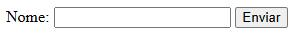
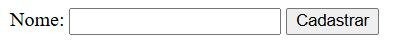
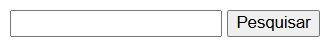
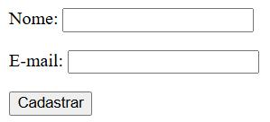
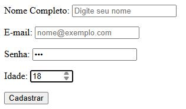
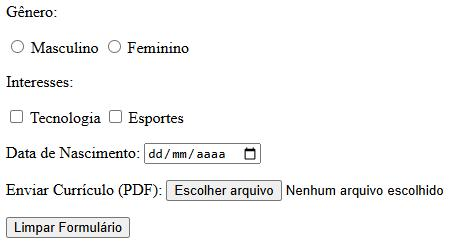
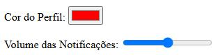

# HTML - Formulários

Os formulários são um dos principais recursos do HTML para permitir a interação entre usuários e páginas web. Por meio deles, é possível coletar informações como:

- Nome;
- E-mail;
- Senha;
- Data de nascimento;
- Endereço;
- Opções de escolha;
- Comentários;
- Arquivos;
- E muito mais.

Os controles de entrada, que também são chamados de campos ou elementos de formulário, são preenchidos pelo usuário. Depois os dados desses campos são enviados para um servidor para serem processados.

**Exemplo simples de formulário:**

```html
<form>
    <label>Nome:</label>
    <input type="text">

    <button>Enviar</button>
</form>
```

**Resultado:**



## O elemento `<form>`

O elemento `<form>` é utilizado para definir o início e o fim de um formulário HTML. O elemento `<form>` funciona como um container para os campos que pertencem ao mesmo formulário.

**Estrutura básica do formulário**

```html
<form>
    <!-- Campos do formulário -->
</form>
```

Um formulário pode conter diferentes tipos de elementos (campos), como:

- label
- input (text, password, email, number, date, checkbox, radio, file)
- select
- textarea
- button

### Atributo `action`

O atributo **`action`** indica para onde os dados do formulário serão enviados para serem processados.

```html
<form action="cadastrar.php">
```

Nesse caso, quando o formulário for enviado, os dados serão encaminhados para o arquivo: "**cadastro.php**"

**Exemplo:**

```html
<form action="cadastro.php">
    <label>Nome:</label>
    <input type="text" name="nome">

    <button type="submit">Cadastrar</button>
</form>
```

**Resultado:**



Quando o usuário enviar o formulário, o servidor poderá processar os dados utilizando o arquivo "**cadastro.php**" indicado no atributo **`action`**.

### Atributo `method`

O atributo **`method`** define como os dados serão enviados. Os dois valores mais utilizados são: **`get`** e **`post`**.

#### Método `GET`

O método **`GET`** envia os dados por meio da URL.

**Exemplo:**

```html
<form action="pesquisar.php" method="get">
    <input type="text" name="pesquisa">

    <button type="submit">Pesquisar</button>
</form>
```

**Resultado:**



Se o usuário pesquisar por JavaScript, a URL será semelhante a:

```html
pesquisar.php?pesquisa=JavaScript
```

O método **`GET`** costuma ser utilizado em:

- Pesquisas;
- Filtros;
- Consultas;
- Formulários em que os dados não são sigilosos.

#### Método `POST`

O método **`POST`** envia os dados no corpo da requisição HTTP.

**Exemplo:**

```html
<form action="cadastro.php" method="post">
    <p><label>Nome:</label>
    <input type="text" name="nome"></p>
    
    <p><label>E-mail:</label>
    <input type="email" name="email"></p>
    
    <button type="submit">Cadastrar</button>
</form>
```

**Resultado:**



O método **`POST`** normalmente é utilizado em:

- Cadastro;
- Login;
- Envio de informações;
- Alteração de dados;
- Upload de arquivos.

**Atenção:** utilizar **`POST`** não significa, por si só, que os dados estão protegidos. Para proteger informações, especialmente senhas, também é necessário utilizar mecanismos como HTTPS e boas práticas de segurança.

## O elemento `<label>`

O elemento **`<label>`** é utilizado para identificar um campo de formulário.

**Exemplo:**

```html
<label>Nome:</label>
<input type="text">
```

O texto **`Nome:`** informa ao usuário qual informação deve ser digitada.

Uma forma mais completa de utilizar o **`<label>`** é associá-lo diretamente ao campo por meio dos atributos **`for`** e **`id`**.

**Exemplo:**

```html
<label for="nome">Nome:</label>
<input type="text" id="nome">
```

Nesse exemplo **`for="nome"`** está associado a **`id="nome"`**. Essa associação melhora a acessibilidade, facilita a interação com o formulário e é uma prática recomendada.

## O elemento `<input>`

O elemento **`<input>`** é utilizado para criar diversos tipos de campos de entrada. Sua estrutura básica é:

```html
<input type="tipo">
```

### Campos de texto e dados básicos

- **`type = "text"`** - Cria uma linha única para digitar textos gerais, como nome, endereço... (valor padrão).

- **`type = "password"`** - Oculta os caracteres digitados com pontos ou asteriscos para senhas.

- **`type = "email"`** - Aceita endereços de e-mail e faz validação básica do formato.

- **`type = "tel"`** - Destinado a números de telefone.

- **`type = "url"`** - Recebe endereços de sites da internet.

- **`type = "number"`** - Aceita apenas números, permitindo definir os limites mínimo e máximo.

- **`type = "search"`** - Formatado de forma específica para campos de busca.

### Seleção e Múltipla Escolha

- **`type = "checkbox"`** - Caixa de seleção que permite marcar uma ou mais opções.

- **`type = "radio"`** - Botão de escolha única em um grupo com o mesmo nome.

### Datas e Horas

- **`type = "date"`** - Abre um calendário para escolher o dia, mês e ano.

- **`type = "time"`** - Seleciona um horário específico (horas e minutos).

- **`type - "datetime-local"`** - Permite escolher a data e o horário juntos.

### Outros Tipos Especiais

- **`type = "file"`** - Permite ao usuário enviar arquivos do seu aparelho.

- **`type = "color"`** - Exibe uma paleta de cores para escolha visual.

- **`type = "range"`** - Mostra uma barra deslizante para escolher números em uma escala.

- **`type = "hidden"`** - Fica escondido na tela, usado para enviar dados ocultos ao servidor.

### Botões de Ação

- **`type = "submit"`** - Cria um botão para enviar os dados do formulário.

- **`type = "reset"`** - Cria um botão para limpar todos os campos preenchidos.

- **`type = "button"`** - : Um botão genérico que não faz nenhuma ação automática sem código extra.

**Exemplo 1 - Cadastro Geral:**

```html
<form action="/enviar-dados" method="POST">
    <!-- Campo de Texto Simples -->
    <p><label for="nome">Nome Completo:</label>
    <input type="text" id="nome" name="nome" required placeholder="Digite seu nome"></p>

    <!-- Campo de E-mail (validação automática) -->
    <p><label for="email">E-mail:</label>
    <input type="email" id="email" name="email" required placeholder="nome@exemplo.com"></p>

    <!-- Campo de Senha (caracteres ocultos) -->
    <p><label for="senha">Senha:</label>
    <input type="password" id="senha" name="senha" required minlength="8"></p>

    <!-- Campo Numérico -->
    <p><label for="idade">Idade:</label>
    <input type="number" id="idade" name="idade" min="18" max="120"></p>

    <!-- Botão de Envio -->
    <button type="submit">Cadastrar</button>
</form>
```

**Resultado:**



**Exemplo 2 - Seleção, Datas e Arquivos**

```html
<form action="/enviar-preferencias" method="POST" enctype="multipart/form-data">
    <!-- Seleção Única (Radio) -->
    <p>Gênero:</p>
    <input type="radio" id="masc" name="genero" value="M">
    <label for="masc">Masculino</label>
    <input type="radio" id="fem" name="genero" value="F">
    <label for="fem">Feminino</label>

    <!-- Seleção Múltipla (Checkbox) -->
    <p>Interesses:</p>
    <input type="checkbox" id="tecnologia" name="interesses" value="tech">
    <label for="tecnologia">Tecnologia</label>
    <input type="checkbox" id="esportes" name="interesses" value="esportes">
    <label for="esportes">Esportes</label>

    <!-- Campo de Data -->
    <p><label for="nascimento">Data de Nascimento:</label>
    <input type="date" id="nascimento" name="nascimento"></p>

    <!-- Upload de Arquivo -->
    <p><label for="curriculo">Enviar Currículo (PDF):</label>
    <input type="file" id="curriculo" name="curriculo" accept=".pdf"></p>

    <!-- Botão de Limpar -->
    <input type="reset" value="Limpar Formulário">
</form>
```

**Resultado:**



**Exemplo 3 - Componentes Visuais Avançados**

```html
<form action="/configuracoes" method="POST">
  <!-- Seleção de Cor -->
  <p><label for="cor-perfil">Cor do Perfil:</label>
  <input type="color" id="cor-perfil" name="cor_perfil" value="#ff0000"></p>

  <!-- Barra Deslizante (Range) -->
  <p><label for="volume">Volume das Notificações:</label>
  <input type="range" id="volume" name="volume" min="0" max="100" step="10"></p>

  <!-- Campo Oculto -->
  <input type="hidden" name="user_id" value="12345">
</form>
```

**Resultado:**



