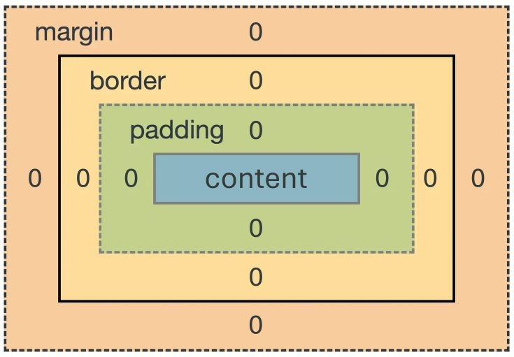

# CSS - Modelo de Caixa (Box Model)

## Introdução

Ao desenvolver páginas web com HTML e CSS, é fundamental compreender como os elementos são exibidos pelo navegador. Para isso, o CSS utiliza um conceito chamado **Box Model** (**Modelo de Caixa**).

No **Box Model**, cada elemento HTML é tratado como uma caixa retangular que possui diferentes áreas responsáveis pelo seu conteúdo, espaçamento e bordas. Entender esse modelo é essencial para criar layouts organizados, alinhar elementos corretamente e controlar o espaço ocupado por cada componente da página.

O **Box Model** define a estrutura visual de um elemento HTML. Cada elemento é composto por quatro partes principais:

1. **Content** (Conteúdo)
2. **Padding** (Espaçamento interno)
3. **Border** (Borda)
4. **Margin** (Espaçamento externo)

**Representação:**



## Área de Conteúdo (Content)

A área de conteúdo é onde ficam os dados do elemento, como textos, imagens, vídeos e outros componentes.

Seu tamanho pode ser definido pelas propriedades:

- `width` (Largura)
- `height` (Altura)
- `max-width` (Largura Máxima)
- `max-height` (Altura Máxima)
- `min-width` (Largura Mínima)
- `min-height` (Altura Mínima)

**Exemplo:**

**HTML**
```html
<div class="caixa">
    Conteúdo da caixa
</div>
```

**CSS**
```css
.caixa {
    width: 300px;
    height: 150px;
    background-color: #f0f0f0;
}
```

## Padding (Espaçamento Interno)

O `padding` representa o espaço entre o conteúdo e a borda do elemento. Ele aumenta a área interna da caixa, criando um afastamento visual entre o conteúdo e as bordas.

**Exemplos:**

**CSS**
```css
.caixa {
    padding: 25px;
}
```

Todos os lados recebem `25px`.

```css
.caixa {
    padding: 10px 20px;
}
```

O topo e a base recebem `10px` e a esquerda e a direita recebem `20px`.

```css
.caixa {
    padding: 10px 20px 30px 40px;
}
```

O topo recebe `10px`, a direita `20px`, a base `30px` e a esquerda `40px`.

**Definindo cada lado do padding:**

```css
padding-top: 10px;
padding-right: 20px;
padding-bottom: 30px;
padding-left: 40px;
```

O mesmo efeito do exemplo anterior.

## Border (Borda)

A borda (`border`) envolve o conteúdo e o `padding`. Ela possui:

- Espessura
- Estilo
- Cor

**Exemplo:**

**CSS**
```css
.caixa {
    border: 3px solid #000;
}
```

**Estilos de borda:**

- `solid`
- `dashed`
- `dotted`
- `double`
- `groove`
- `ridge`
- `inset`
- `outset`
- `none` (padrão)

**Exemplo:**

**CSS**
```css
border: 3px dashed blue;
```

**Configurando separadamente:**

```css
border-width: 2px;
border-style: solid;
border-color: red;
```

## Margin (Espaçamento Externo)

A `margin` representa o espaço externo ao elemento. Ela é utilizada para afastar um elemento dos demais elementos da página.

**Exemplo:**

**CSS**
```css
.caixa {
    margin: 10px;
}
```

O elemento ficará afastado 10 pixels dos elementos ao seu redor.

**Definindo individualmente:**

```css
.caixa {
    margin-top: 10px;
    margin-right: 15px;
    margin-bottom: 20px;
    margin-left: 25px;
}
```

**Forma abreviada**

```css
.caixa {
    margin: 10px 15px 20px 25px;
}
```

## A Propriedade box-sizing

Como o navegador calcula o tamanho da caixa? Por padrão, a propriedade `box0sizing` do CSS utiliza o valor `content-box`:

```css
box-sizing: content-box;
```

Nesse modo, a largura e a altura do elemento, definem apenas o conteúdo.

**Exemplo:**

```css
.caixa {
    width: 300px;
    padding: 20px;
    border: 5px solid black;
}
```

Cálculo da largura total:

```
  300px (conteúdo)
+  20px (padding esquerdo)
+  20px (padding direito)
+   5px (borda esquerda)
+   5px (borda direita)
----------------------------
= 350px (largura total)
```

A largura final será de `350px`.

Para simplificar o cálculo das dimensões, utiliza-se a propriedade `border-box` com o valor `border-box`:


```css
box-sizing: border-box;
```

Nesse modo, a largura e a altura do elemento, definem o tamanho total da caixa. O navegador ajusta automaticamente o espaço interno para que a caixa inteira mantenha exatamente os valores definidos.

**Exemplo:**

```css
.caixa {
    width: 300px;
    padding: 20px;
    border: 5px solid black;
    box-sizing: border-box;
}
```

Agora, nesse exemplo, a largura final será de `300px`.

**Vantagens:**

- Facilita a criação de layouts.
- Evita cálculos manuais.
- Torna o design mais previsível.
